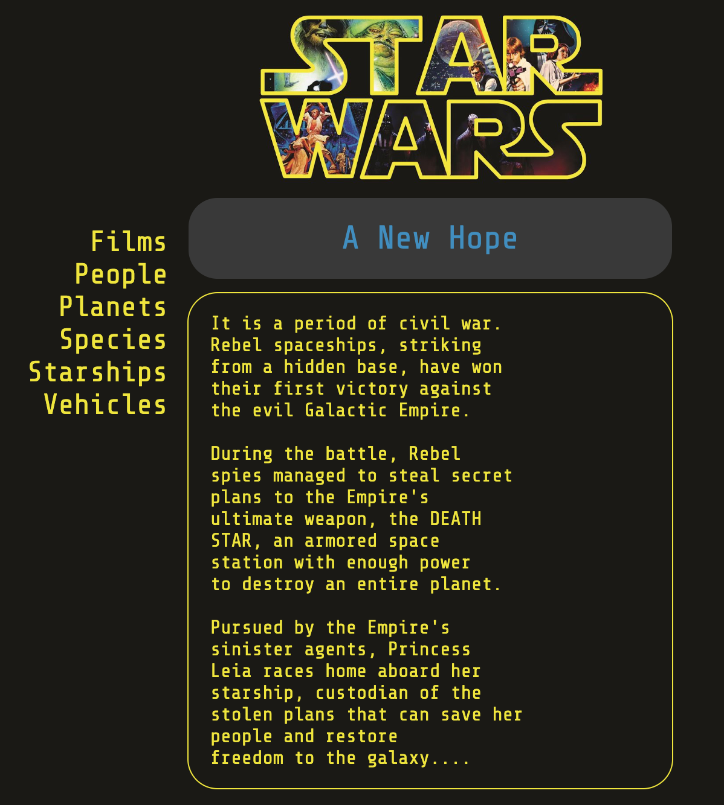

# Star-Wars API & UI

## Description
This project displays data from the Star Wars [API](https://swapi.co/) using CSS and Javascript. I used the collapsible [accordion example](https://www.w3schools.com/howto/howto_js_accordion.asp) from W3schools to get me started on creating the UI. Clicking on each item in the menu will display the first 10 items in each category in the database.

## Installing
The only thing that you need to do to install this project is to copy the files into a folder on your web server. The API is completely open and does not require any further configuration.

## API Notes
A key thing to note about the API is that each category has a different hierarchy. So, I needed to create a seperate request for each one. This gave me a lot more control on what I could display at the cost of added quite a bit to the Javascript code.

The server hosting the API can struggle to stay stable at times. I think it has a tendancy to slow down when there are a number of API requests. It usually comes back to life after a few minutes or so.

## Future Updates
I'd like to set up a link for each category that would let the user see the rest of the database. A next link is currently functional but it's not perfect. Right now I just have it add another 10 to the current list when it's clicked and that can make the page quite long. I'd eventually like to set it up where the next button takes it to the next 'page'. 